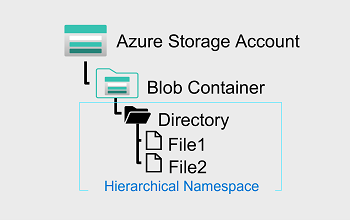

[Go back](README.md)

# Introduction to Azure Data Lake Storage
Data lakehouses provide a solution to a problem of many data warehouses and BI solutions: ability to store unstructured data.

A data lake provides file-based storage, usually in a distributed file system that supports high scalability for massive volumes of data. Org's can store structured, semi-structured and unstructured data in the data lake, and then consume them from there using big data processing technologies (Spark)

## Understand Azure Data Lake Storage
Data lake is a repository of data stored in its natural form, usually blob or files.

ADLS combines a file system with a storage platform which helps with quickly identifying insights into the data.

## Benefits
Remember the **3 V's of Big data**: 
* **Volume** (exabyte)
* **Variety** (structured, semi and unstructured)
* **Velocity** (high throughput of data)

With this, you can use ADLS as the basis for both real-time data and data in batches.

## Hadoop compatibility
Benefit is you can treat the data as if it's stored in the Hadoop file system (HDFS)

With this, you can store the data in ADLS and access it through Databricks for example, without moving the data. The engineer also has the option to store the data in formats such as parquet, which is highly compressed and performs well using an internal columnar storage.

## Security
Support ACLS and POSIX permissions for files and folders, which can be used to restrict access between users/ groups.

All data that is stored is encrypted at rest using Microsoft or customer-managed keys.

## Performance
Data is organized into a hierarchy of directories and subdirectories, much like a file system, for easier navigation.

## Data redundancy

Data Lake Storage takes advantage of the Azure Blob replication models that provide data redundancy in a single data center with locally redundant storage (LRS), or to a secondary region by using the Geo-redundant storage (GRS) option. This feature ensures that your data is always available and protected if catastrophe strikes.

## Tip!
Whenever planning for a data lake, a data engineer should give thoughtful consideration to structure, data governance, and security. This should include consideration of factors that can influence lake structure and organization, such as:

* Types of data to be stored
* How the data will be transformed
* Who should access the data
* What are the typical access patterns

## Compare ADLS to Azure Blob storage
Blog storage stores unstructured ("object") data in a flat namespace within a blog container. Names can contain "/" to organize blobs into virtual "folders", but the blobs are stored as single-level hierarchy in a flat namespace. 
* Data can be accessed via **HTTP or HTTPS**

ADLS builds on top of blob storage and optimizes I/O of high-volume data by using a hierarchical namespace that organizes blob data into *directories*, and stores **metadata** about each directory and files within it.

## Understanding the stages for processing big data
Fundemental role in wide range of big data architectures. They can involve the creation of:
* An enterprise data warehouse
* Advanced analytics against big data
* A real-time analytical solution

There are four stages for processing big data solutions:
* **Ingest** 
    * This phase identifies technology and processes that are used to acquire the source data.
    * Data can come files, logs and other types of unstructured data that must be put into the data lake.
    * Technology used varies depending on the frequency of the data; 
        * For batch - Pipelines in Synapse or ADF 
        * For stream - Kafka or Stream Analytics
* **Store**
    * Identifies where the ingested data should be placed.
* **Prep and train**
    * Identifies technologies that are used to perform data prep and model training
    * Common technologies are Synapse, Databricks, HDInsight, Azure ML
* **Model and serve**
    * Identifies technologies that will present the data to users.
    * Visualization tools such as Microsoft Power BI (although often it is a combination of multiple)

## Use ADLS in data analytics workloads
ADLS can be characterized as an ENABLING technology for multiple data analytics use cases.

### Big data processing and analytics
Big data scenarios usually refer to analytical workloads that involve massive *volumes* of data in a *variety* of formats that need to be processed at a fast *velocity* (again, three V's)

ADLS provides a scalable and secure distributed data store, on which big data services such as Synapse, Databricks and HDInsight can apply data processing frameworks such as Spark, Hive, Hadoop

### Data warehousing
Data warehousing has evolved in recent year sot integrate large volumes of data stored as files in a data lake with relational tables in a data warehouse.

Typical scenario: 
* Data is extracted from operational data stores (such as Azure SQL database), transformed into structures more suitable for analytical workloads and loaded into a data lake
    * This often includes staging data in data lake in order to facilitate distributed processing 
        * Remember how Montepio had three "layers" in data lake: **Raw**, **Processed**, **Enriched**
* Data is then treated via ETL processes using ADF, hosted on Synapse
* Data is then loaded into a relational data warehouse in an Azure Synapse SQL pool, from where it can support data visualization and reporting using Power BI

### Real-time data analytics
Increasingly, businesses and other orgs need to capture perpetual streams of data and analyze it in real-time (or as close as possible).

Unlike traditional batch processing workloads, streaming data requires a solution that can capture and process a boundless stream of data events as they occur.

Streaming event are often captured in a queue for processing (using something like Azure Event Hubs). From there, the data is processed, often to aggregate data over temporal windows (for example to count the number of social media messages with a given tag every five minutes etc.).
Azure Stream Analytics enables you to create jobs that query and aggregate event data as it arrives, and write the results in an output sink. (one such sink is ADLS)

### Data science and machine learning
DS involves the statistical analysis of large volumes of data, often using tools such as Spark and Python. ADLS provides a highly scalable cloud-based data store for the volumes of data required in DS workloads.

ML is a subarea of DS that deals with training predictive models. Model training requires huge amounts of data (think ChatGPT 4.0 graphs)

## Summary
Azure Data Lake Storage Gen2 provides a cloud storage service that is available, secure, durable, scalable, and redundant. It's a comprehensive data lake solution.

Azure Data Lake Storage brings efficiencies to process big data analytics workloads and can provide data to many compute technologies including Azure Synapse Analytics, Azure HDInsight, and Azure Databricks without needing to move the data around. Creating an Azure Data Lake Storage Gen2 data store can be an important tool in building a big data analytics solution.