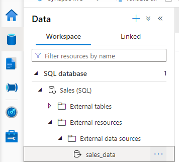
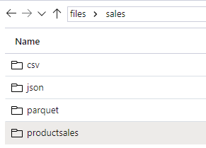

[Go back](README.md)

# Use Azure Synapse serverless SQL pool to query files in a data lake

SQL Pools are tailored towards querying data in a data lake. With it, you can use SQL code to query the data in various file formats, **without needing to load the data into database storage**.

### Understand capabilities and use cases
Azure Synapse SQL is a distributed query system in Azure Synapse Analytics that offers two kinds of runtime environments:

* **Serverless** SQL pool: on-demand SQL query processing, primarily used to work with data in a data lake.
* **Dedicated** SQL pool: Enterprise-scale relational database instances used to host data warehouses in which data is stored in relational tables.

SQL Pools provide a *pay-per-query* endpoint to query the data in your data lake 

## Query files using a serverless SQL pool
You can use a serverless SQL pool to query data files in various common file formats, including:

* Delimited text, such as comma-separated values (CSV) files.
* JavaScript object notation (JSON) files.
* Parquet files.

```sql
SELECT TOP 100 *
FROM OPENROWSET(
    BULK 'https://mydatalake.blob.core.windows.net/data/files/*.csv',
    FORMAT = 'csv') AS rows
```
The **OPENROWSET** function includes more parameters that determine factors such as:

* The schema of the resulting rowset
* Additional formatting options for delimited text files.

The **BULK** parameter includes the full URL to the location in the data lake containing the data files.

You can also use '*' to include or exclude files.  

* `https://mydatalake.blob.core.windows.net/data/files/file1.csv`: Only include file1.csv in the files folder.
* `https://mydatalake.blob.core.windows.net/data/files/file*.csv`: All .csv files in the files folder with names that start with "file".

### Querying CSV

```sql
SELECT TOP 100 *
FROM OPENROWSET(
    BULK 'https://mydatalake.blob.core.windows.net/data/files/*.csv',
    FORMAT = 'csv',
    PARSER_VERSION = '2.0',
    FIRSTROW = 2) AS rows
```

The PARSER_VERSION is used to determine how the query interprets the text encoding used in the files. Version 1.0 is the default and supports a wide range of file encodings, while version 2.0 supports fewer encodings but offers better performance. 

The FIRSTROW parameter is used to skip rows in the text file, to eliminate any unstructured preamble text or to ignore a row containing column headings.

#### Specifying the rowset schema
For example, consider the following delimited text:

```text
product_id,product_name,list_price
123,Widget,12.99
124,Gadget,3.99
```

The data consists of the following three columns:

* product_id (integer number)
* product_name (string)
* list_price (decimal number)

You could use the following query to extract the data with the correct column names and appropriately inferred SQL Server data types (in this case INT, NVARCHAR, and DECIMAL)

```sql
SELECT TOP 100 *
FROM OPENROWSET(
    BULK 'https://mydatalake.blob.core.windows.net/data/files/*.csv',
    FORMAT = 'csv',
    PARSER_VERSION = '2.0',
    HEADER_ROW = TRUE) AS rows
```

The HEADER_ROW parameter (which is only available when using parser version 2.0) instructs the query engine to use the first row of data in each file as the column names, like this:

| product_id    | product_name      | list_price    |
| -----------   | -----------       | -----------   |
| 123           | Widget            | 12.9900       |
| 124           | Gadget            |	3.9900      |


Now consider the following data:

```text
123,Widget,12.99
124,Gadget,3.99
```

This time, the file doesn't contain the column names in a header row; so while the data types can still be inferred, the column names will be set to C1, C2, C3, and so on.

| c1    | c2      | c3    |
| -----------   | -----------       | -----------   |
| 123           | Widget            | 12.9900       |
| 124           | Gadget            |	3.9900      |

To specify explicit column names and data types, you can override the default column names and inferred data types by providing a schema definition in a WITH clause, like this:

```sql
SELECT TOP 100 *
FROM OPENROWSET(
    BULK 'https://mydatalake.blob.core.windows.net/data/files/*.csv',
    FORMAT = 'csv',
    PARSER_VERSION = '2.0')
WITH (
    product_id INT,
    product_name VARCHAR(20) COLLATE Latin1_General_100_BIN2_UTF8,
    list_price DECIMAL(5,2)
) AS rows
```

Produces: 

| product_id    | product_name      | list_price    |
| -----------   | -----------       | -----------   |
| 123           | Widget            | 12.9900       |
| 124           | Gadget            |	3.9900      |

### Querying JSON

For example, a JSON file that defines an individual product might look like this:

```json
{
    "product_id": 123,
    "product_name": "Widget",
    "list_price": 12.99
}
```

To return product data from a folder containing multiple JSON files in this format, you could use the following SQL query:

```sql
SELECT doc
FROM
    OPENROWSET(
        BULK 'https://mydatalake.blob.core.windows.net/data/files/*.json',
        FORMAT = 'csv',
        FIELDTERMINATOR ='0x0b',
        FIELDQUOTE = '0x0b',
        ROWTERMINATOR = '0x0b'
    ) WITH (doc NVARCHAR(MAX)) as rows
```

OPENROWSET **has no specific format for JSON files**, so you must use csv format with **FIELDTERMINATOR**, **FIELDQUOTE**, and **ROWTERMINATOR** set to *0x0b*, and a schema that includes a single NVARCHAR(MAX) column. The result of this query is a rowset containing a single column of JSON documents, like this:

| doc    |
| -----------   |
| {"product_id":123,"product_name":"Widget","list_price": 12.99} |
| {"product_id":124,"product_name":"Gadget","list_price": 3.99}  |

To extract individual values from the JSON, use **JSON_VALUE**:

```sql
SELECT JSON_VALUE(doc, '$.product_name') AS product,
           JSON_VALUE(doc, '$.list_price') AS price
FROM
    OPENROWSET(
        BULK 'https://mydatalake.blob.core.windows.net/data/files/*.json',
        FORMAT = 'csv',
        FIELDTERMINATOR ='0x0b',
        FIELDQUOTE = '0x0b',
        ROWTERMINATOR = '0x0b'
    ) WITH (doc NVARCHAR(MAX)) as rows
```

Result table:

| product    | price      | 
| -----------   | -----------       | 
| Widget           | 12.99            | 
| Gadget           | 3.99            |

### Querying Parquet
Parquet is a commonly used format for big data processing on distributed file storage. It's an efficient data format that is optimized for compression and analytical querying.

In most cases, the schema is embedded within the Parquet file.

```sql
SELECT TOP 100 *
FROM OPENROWSET(
    BULK 'https://mydatalake.blob.core.windows.net/data/files/*.*',
    FORMAT = 'parquet') AS rows
```

#### Querying partitioned data
Parquets are often partitioned by splitting across multiple files in sub-folders that reflect the partitioning criteria.

For example, suppose you need to efficiently process sales order data, and often need to filter based on the year and month in which orders were placed. You could partition the data using folders, like this:

* /orders
    * /year=2020
        *  /month=1
            * /01012020.parquet
            * /02012020.parquet
            * ...
        *  /month=2
            *  /01022020.parquet
            *  /02022020.parquet
            * ...
            *  ...
    * /year=2021
        * /month=1
        * /01012021.parquet
        * /02012021.parquet
        * ...
        * ...

Query results from January to February 2020: 

```sql
SELECT *
FROM OPENROWSET(
    BULK 'https://mydatalake.blob.core.windows.net/data/orders/year=*/month=*/*.*',
    FORMAT = 'parquet') AS orders
WHERE orders.filepath(1) = '2020'
    AND orders.filepath(2) IN ('1','2');
```

The numbered filepath parameters in the WHERE clause reference the wildcards in the folder names in the BULK path -so the parameter 1 is the * in the year=* folder name, and parameter 2 is the * in the month=* folder name.

## Create external database objects

Sometimes you may want to create a custom database that contains some objects which you need frequently

You can create a database in a serverless SQL pool just as you would in a SQL Server instance (either graphical tool; or `CREATE DATABASE` statement)


### Creating an external data source

If the same path is being often queried, it can be more efficient to create an external data source, which can then be referenced in the future queries

```sql
CREATE EXTERNAL DATA SOURCE files
WITH (
    LOCATION = 'https://mydatalake.blob.core.windows.net/data/files/'
)
```

We can now use the simplified OPENROWSET query: 

```sql
SELECT *
FROM
    OPENROWSET(
        BULK 'orders/*.csv',
        DATA_SOURCE = 'files',
        FORMAT = 'csv',
        PARSER_VERSION = '2.0'
    ) AS orders
```

Another benefit is **assigning a credential for the data source** to use when accessing the underlying storage.

For example: 

```sql
CREATE DATABASE SCOPED CREDENTIAL sqlcred
WITH
    IDENTITY='SHARED ACCESS SIGNATURE',  
    SECRET = 'sv=xxx...';
GO

CREATE EXTERNAL DATA SOURCE secureFiles
WITH (
    LOCATION = 'https://mydatalake.blob.core.windows.net/data/secureFiles/'
    CREDENTIAL = sqlcred
);
GO
```

## Exercise - Query files using a serverless SQL pool

Section below will contain brief explanation of the exercises, and queries used to solve them.

### Query data in files
Running the ./setup sh file will produce the following file structure in a data lake:

* files
    * csv
        * 2019.csv
        * 2020.csv
        * 2021.csv
    * json
        * SO43700.json
        * ...
        * S043705.json
    * parquet
        * year=2019
        * year=2020
        * year=2021

Selecting TOP 100, and adding the *HEADER_ROW = TRUE* option will throw the following error:

```
Potential conversion error while reading VARCHAR column 'SO43701' from UTF8 encoded text. ...
```

To get around it, **manually type out the header rows** in the query:

```sql
-- This is auto-generated code
SELECT
    TOP 100 *
FROM
    OPENROWSET(
        BULK 'https://datalakexxxxxx.dfs.core.windows.net/files/sales/csv/**',
        FORMAT = 'CSV',
        PARSER_VERSION = '2.0'
    ) WITH(
    SalesOrderNumber VARCHAR(50) 1,
    SalesOrderLineNumber INT 2,
    OrderDate VARCHAR(50) 3,
    CustomerName VARCHAR(50) 4,
    EmailAddress VARCHAR(50) 5,
    Item VARCHAR(50) 6,
    Quantity INT 7,
    UnitPrice FLOAT 8,
    TaxAmount FLOAT 9
)AS [result]
```

### Create an external data source and file format

Create a data source which can be later referenced for accessing the data lake location.

To use these objects to work with external tables, they need to be created in a database **OTHER THAN THE DEFAULT MASTER** database

Run the following script:

```sql
 -- Database for sales data
 CREATE DATABASE Sales
   COLLATE Latin1_General_100_BIN2_UTF8;
 GO;
    
 Use Sales;
 GO;
    
 -- External data is in the Files container in the data lake
 CREATE EXTERNAL DATA SOURCE sales_data WITH (
     LOCATION = 'https://datalakexxxxxxx.dfs.core.windows.net/files/'
 );
 GO;
    
 -- Format for table files
 CREATE EXTERNAL FILE FORMAT ParquetFormat
     WITH (
             FORMAT_TYPE = PARQUET,
             DATA_COMPRESSION = 'org.apache.hadoop.io.compress.SnappyCodec'
         );
 GO;
```

This will create a new database "Sales". Navigate to Data->Workspace and it should be created.



### Create an External table

Once again, the **provided script breaks** since it's either missing the HEADER row, or it can't be deduced automatically. 

Use the following script:

```sql
USE Sales;
GO;

CREATE EXTERNAL TABLE ProductSalesTotals
     WITH (
         LOCATION = 'sales/productsales/',
         DATA_SOURCE = sales_data,
         FILE_FORMAT = ParquetFormat
     )
AS
SELECT  
    Item AS Product,
        SUM(Quantity) AS ItemsSold,
        ROUND(SUM(UnitPrice) - SUM(TaxAmount), 2) AS NetRevenue
FROM
    OPENROWSET(
        BULK 'sales/csv/*.csv',
        DATA_SOURCE = 'sales_data',
        FORMAT = 'CSV',
        PARSER_VERSION = '2.0'
    ) 
    WITH(
    SalesOrderNumber VARCHAR(50) 1,
    SalesOrderLineNumber INT 2,
    OrderDate VARCHAR(50) 3,
    CustomerName VARCHAR(50) 4,
    EmailAddress VARCHAR(50) 5,
    Item VARCHAR(50) 6,
    Quantity INT 7,
    UnitPrice FLOAT 8,
    TaxAmount FLOAT 9
) AS orders
 GROUP BY Item;
```

#### Summary

This lesson teaches us how to create an external table, which can be used for example in a downstream process to load the transformed data into a data warehouse. 

It starts of by creating a database `Sales` (remember, external tables can't be created on **master**) and defining an `EXTERNAL DATA SOURCE` and a `FILE FORMAT`.

##### External data source

Essentially a file container in the data lake (after running the initial script, you can find the newly created folder under */files/sales/productsales/*)



#### File format

Defines in which file format will the data be saved in the defined external data source.

For this example, PARQUET is used.

Notice how the data is not partitioned, so there are no sub-folders, unlike in the provided */files/sales/parquet/* folder where data is partitioned by year.

### Encapsulate data transformation in a stored procedure.

If you will need to transform data frequently, you can use a stored procedure to encapsulate a CETAS (CREATE EXTERNAL TABLE AS SELECT) statement.

Once again, the script will fail due to missing HEADER rows, so just add them as in the previous lesson. 

**Change to Sales database!**

## Knowledge check

1. What function is used to read the data in files stored in a data lake?

* FORMAT
* ROWSET
* OPENROWSET

<details>
<summary>Answer</summary>
The correct answer is: <b>OPENROWSET</b>
</details>

2. What character in file path can be used to select all the file/folders that match rest of the path? 

* &
* \*
* /

<details>
<summary>Answer</summary>
The correct answer is: <b>\</b>
</details>

3. Which external database object encapsulates the connection information to a file location in a data lake store? 

* FILE FORMAT
* DATA SOURCE
* EXTERNAL TABLE

<details>
<summary>Answer</summary>
The correct answer is: <b>DATA SOURCE</b>
</details>

