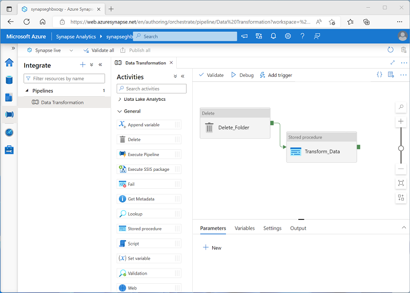

[Go back](README.md)

# Use Azure Synapse serverless SQL pools to transform data in a data lake
Engineers often need to use SQL to **transform** data; often as part of a data ingestion pipeline or an ETL process.

This module explores how to use `CREATE EXTERNAL TABLE AS SELECT` statements to transform data, and store the results in files in a data lake that can be queried through relational table in a serverless SQL database (exhales)

## Transform data files with the CETAS statement
SQL can be used to: 
* Filter rows and columns in a dataset.
* Rename data fields and convert between data types.
* Calculate derived data fields.
* Manipulate string values.
* Group and aggregate data.

You can use a CREATE EXTERNAL TABLE AS SELECT (CETAS) statement in a dedicated SQL pool or serverless SQL pool to persist the results of a query in an external table, which stores its data in a file in the data lake.

CETAS statement includes a SELECT statement that queries data from any valid data source, and it's results are persisted in an external table, which is a metadata object in a database that provides a relational abstraction over data stored in files. 

## Creating external database objects to support CETAS

This was already covered in [Chapter 4 exercise](./chapter4-serverless_sql_pools_query.md#create-an-external-data-source-and-file-format)

Essentially, you need to create: 
* Data source
* File format

And using those you can then create an external table:

#### External data source
```sql
-- Create an external data source for the Azure storage account
CREATE EXTERNAL DATA SOURCE files
WITH (
    LOCATION = 'https://mydatalake.blob.core.windows.net/data/files/',
    TYPE = HADOOP, -- For dedicated SQL pool
    -- TYPE = BLOB_STORAGE, -- For serverless SQL pool
    CREDENTIAL = storageCred
);
```

#### External file format
```sql
CREATE EXTERNAL FILE FORMAT ParquetFormat
WITH (
        FORMAT_TYPE = PARQUET,
        DATA_COMPRESSION = 'org.apache.hadoop.io.compress.SnappyCodec'
    );
```

#### Using the CETAS statement
```sql
CREATE EXTERNAL TABLE SpecialOrders
    WITH (
        -- details for storing results
        LOCATION = 'special_orders/',
        DATA_SOURCE = files, --external source
        FILE_FORMAT = ParquetFormat -- external file format
    )
AS
SELECT OrderID, CustomerName, OrderTotal
FROM
    OPENROWSET(
        -- details for reading source files
        BULK 'sales_orders/*.csv',
        DATA_SOURCE = 'files',
        FORMAT = 'CSV',
        PARSER_VERSION = '2.0',
        HEADER_ROW = TRUE
    ) AS source_data
WHERE OrderType = 'Special Order';
```

You **must** use the external data source to specify the location.

To drop an external table, use the following query: 

```sql
DROP EXTERNAL TABLE SpecialOrders;
```

## Encapsulate data transformations in a stored procedure

It's a good practice to encapsulate the CETAS statement in a stored procedure. This approach makes it easier to operationalize data transformations by enabling supply of parameters, retrieving outputs, and add additional logic.

```sql
CREATE PROCEDURE usp_special_orders_by_year @order_year INT
AS
BEGIN

	-- Drop the table if it already exists
	IF EXISTS (
                SELECT * FROM sys.external_tables
                WHERE name = 'SpecialOrders'
            )
        DROP EXTERNAL TABLE SpecialOrders

	-- Create external table with special orders
	-- from the specified year
	CREATE EXTERNAL TABLE SpecialOrders
		WITH (
			LOCATION = 'special_orders/',
			DATA_SOURCE = files,
			FILE_FORMAT = ParquetFormat
		)
	AS
	SELECT OrderID, CustomerName, OrderTotal
	FROM
		OPENROWSET(
			BULK 'sales_orders/*.csv',
			DATA_SOURCE = 'files',
			FORMAT = 'CSV',
			PARSER_VERSION = '2.0',
			HEADER_ROW = TRUE
		) AS source_data
	WHERE OrderType = 'Special Order'
	AND YEAR(OrderDate) = @order_year
END
```

Note that dropping the table does not delete the folder containing its data files. You have to do that manually.

Other benefits of the stored procedure:

* Reduces client to server network traffic
    * Commands in a procedure are executed as a single batch of code. 
* Provides a security boundary
    * Multiple users and client programs can perform operations on underlying database objects through a procedure, even if the users and programs don't have direct permissions to access them (underlying DBO)
* Eases maintenance
    * Any changes in the logic or file system locations involved in the data transformation can be applied only to the stored procedure; without requiring updates to client applications or other calling functions.
* Improved performance
    * Stored procedures are compiled the first time they're executed, and the resulting execution plan is held in cache and reused on subsequent runs of the same procedure.

## Include a data transformation stored procedure in a pipeline

Created stored procedures can be called in Synapse pipelines as a part of an overall ETL pipeline

For example, you can create a pipeline that includes the following activities:

* A Delete activity that deletes the target folder for the transformed data in the data lake if it already exists.
* A Stored procedure activity that connects to your serverless SQL pool and runs the stored procedure that encapsulates your CETAS operation.



Creating a pipeline for the data transformation enables scheduling of the operations to run at specific times (or based on specific events)

## Exercise 

TODO!