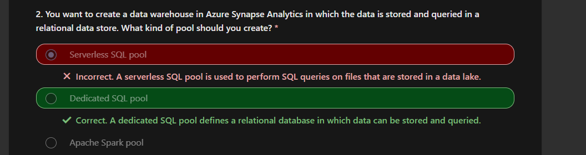
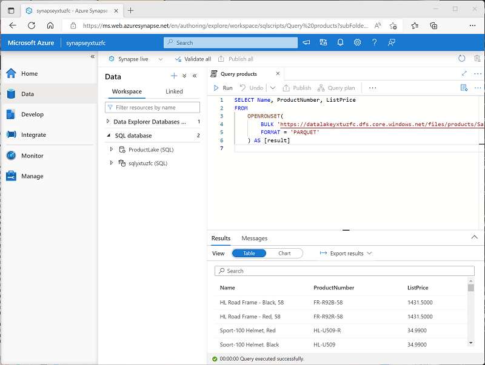

[Go back](../README.md)

# Azure Synapse Analytics

## Introduction
Volume of data generated by individuals and organizations is continuously growing. This data powers businesses and orgs by providing a basis for descriptive ?? **TODO: FILL OUT LATER**

## What is Azure Synapse Analytics?
Four common types of analytical technique that organizations commonly use:

* **Descriptive analytics**: Answers the question: *"What is happening in my business?"*. 
    * The data to answer this question is typically answered through the creation of a data warehouse in which historical data is persisted in relational tables for multidimensional modeling and reporting.
* **Diagnostic analytics**: Answers the question: *"Why is it happening?*
    * Involves exploring information that already exists in a data warehouse, but typically involves a wider search of your data estate to find more data to support this type of analysis.
* **Predictive analytics**: Answers the question: *"What is likely to happen in the future based on previous trends and patterns?*
* **Prescriptive analytics**: Enables autonomous decision making based on real-time or near real-time analysis of data, using predictive analysis.

Azure Synapse Analytics is an integrated solution which answers all of these questions, providing support for **multiple data storage, processing, and analysis technologies**.

## How Synapse works
Combines a centralized service for data storage and processing with an extensible architecture through which *linked services* enable you to integrate commonly used data stores, processing platforms and visualization tools.

Most of this chapter is just brief descriptions on what you can do with data, pipelines etc. 

### Ingesting and transforming data with pipelines
In most enterprise data analytics solutions, data is extracted from multiple operational sources and transferred to a central data lake or data warehouse for analysis.

Synapse includes build-in support for creating, running and managing *pipelines* that orchestrate the activities necessary to **retrieve data** from a range of sources, **transform the data** as required, and **load** the resulting transformed data into an analytical store *(so, basically, ETL (or ELT if you're hip and up-to-date))*

### Querying and manipulating data with SQL
SQL is an ubiquitous language for querying and manipulating data, and is the foundation for relational databases, including MSSQL. Synapse supports SQL-based data querying and manipulation through two kinds of SQL *pool* that are based on the SQL Server relational database engine: 
* A built-in *serverless* pool that is optimized for using relational SQL semantics to query **file-based data** in a data lake
* Custom *dedicated* SQL pools that host **relational data** warehouses. 

The Azure Synapse SQL system uses a distributed query processing model to parallelize SQL operations, resulting in a highly scalable solution for relational data processing. You can use the built-in serverless pool for cost-effective analysis and processing of file data in the data lake, and use dedicated SQL pools to create relational data warehouses for enterprise data modeling and reporting.

Here you can see how to open big data format with SQL (OPENROWSET)

### Processing and analyzing data with Apache Spark
Apache Spark is an open-source platform for big data analytics. Spark performs distributed processing of files in a data lake by running jobs that can be implemented using any of a range of supported programming languages. Languages supported in Spark include Py, Scala, Java, SQL, C#. 

In Synapse, you can create one or more Spark pools and use interactive *notebooks* to combine code and notes as you build solutions for data analytics, machine learning, and data visualization. 

### Exploring data with Data Explorer
Data Explorer is a data processing engine in Synapse that is based on the same service.

Uses KQL to enable high performance, low-latency analysis of batch and streaming data.

### Integrating with other Azhure data services
Synapse can be intergrated with the following services:
* Azure Synapse Link
* Microsoft Power BI
* Microsoft Purview
* Azure Machine Learning

## When to use Synapse
Common use cases for Synapse are identified by the need for: 
* Large-scale data warehousing:
    * Data warehousing includes the need to integrate all data, including big data, to reason over data for analytics and reporting purposes from a descriptive analytics perspective, independent of its location and structure.
* Advanced analytics: 
    * Enables predictive analysis using both the native features of Synapses, and integrating with other technologies such as Azure Machine Learning.
* Data exploration and discovery
    * Serverless SQL pool functionality enables DA's, DE's, DS's alike to explore the data within your data estate. 
    * This capability supports data discovery, diagnostic analytics, and exploratory data analysis. 
* Real time analytics
    * Provides capturing, storing and analyzing of data in real-time or near-real time 
* Data integration
    * Enables you to ingest, prepare, model and serve the data to be used by downstream systems. 
* Integrated analytics
    * Basically, it removes the complexity of putting together all of the previous points; it provides a singular, unified solution for all of the needs of data warehousing, storing, analysis and more. 

