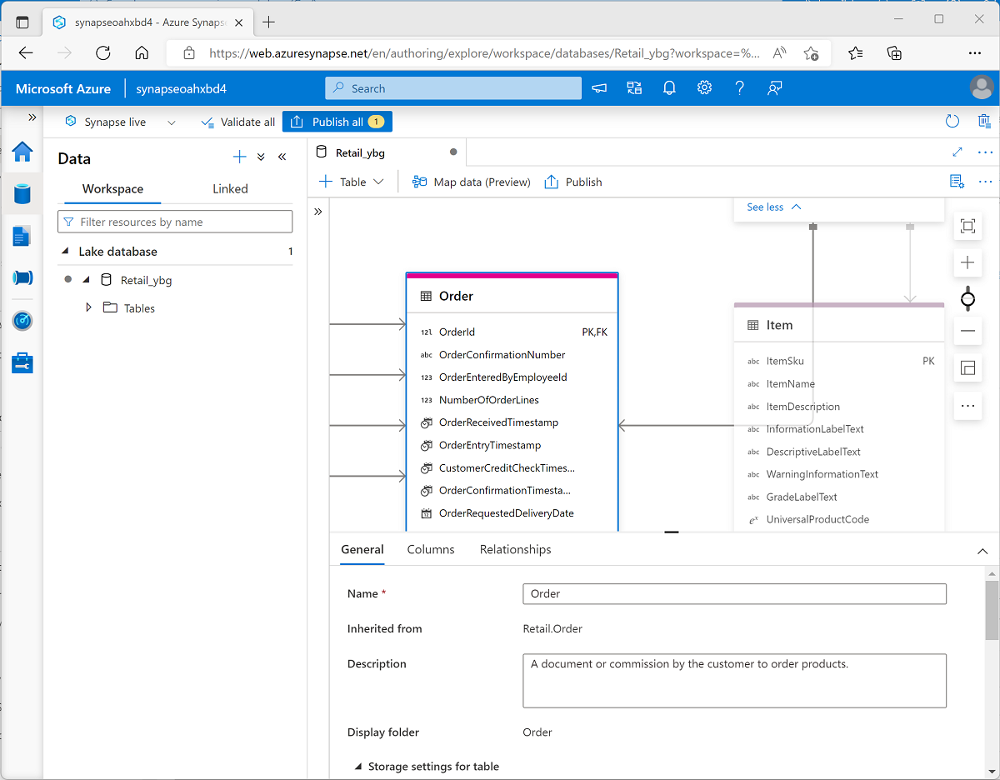

[Go back](../README.md)

* All of the concepts defined here are very similar to **Apache Hive Metastore**, but it is integrated into Microsoft's ecosystem. 

# Create a lake database in Azure Synapse Analytics

Lake databases in Azure Synapse Analytics provide a way to combine storing data files in a data lake, with the advantages of a structured schema in a relational database.

## Understanding important concepts
In a relational database, the db schema is composed of: 
* Tables
* Views 
* Other objects

**Tables** in a relational database define the entities for which data is stored; for example, a retail database might include tables for products, customers, orders etc. 

Each entity consists of a set of attributes that are defined as columns in the table, and each column has a name and a data type. The data is stored in a database and is tightly coupled to the table definition, which enforces data types, nullability ETC. (everything which database does - ACID)

In a data lake, there is no fixed schema. Data is stored in files which may be structured, unstructured or semi-structured.

A *lake database* provides a relational metadata layer over one or more files in a data lake. This allows defining tables, including column names and data types, as well as relationships between PK and FK columns, as well as working with and querying the data with SQL. However, the data storage is decoupled from the database schema, enabling more flexibility. 

### Lake database schema
You can create a lake database (in Synapse), and define the tables that represent the entities for which you need to store data. 

Synapse also includes a GUI that you can use to model complex database schema.

### Lake database storage 
The data for the tables is stored in the data lake, in Parquet or CSV files. They can be managed independently of the database tables. 

### Lake database compute
You can use serverless SQL pools to run SQL queries to query and manipulate the data through defined tables, or you can use Spark (with Spark SQL)


## Explore database templates
This chapter basically just tells you that Azure Synapse provides you with some database templates that reflect common schemas found in different business scenarios, such as:

* Agriculture
* Automotive 
* Banking

etc.

## Create a lake database
You can create one using the lake database designer in Azure Synapse. It provides a drag-and-drop surface on which you can edit the tables in your database and the relationship between them.



Using the database designer, you can define the schema for your database by adding or removing tables and:

* Specifying the name and storage settings for each table.
* Specifying the names, key usage, nullability, and data types for each column.
* Defining relationships between key columns in tables.

## Use a lake database
After creating a lake database, you can store data files that match the table schemas in the appropriate folders in the data lake, and query them using SQL.

### Using a serverless SQL pool 
Suppose a lake database named **RetailDB** contains **Customer** table. You can query it like this: 

```sql
USE RetailDB;
GO

SELECT CustomerID, FirstName, LastName
FROM Customer
ORDER BY LastName;
```

Notice there is no need to use an OPENROWSET function, since the serverless SQL pool handles the underlying mapping to the files for you. 

## Exercise
Won't go over the creation of the lake database too much, but essentially the steps are:

* Create a Lake database in the **Workspace** tab of the **Data** page
* Create the folder underlying folder on the ADLS

### Create a table
Once the lake database is created, the schema can be defined by creating tables.

To create a table, you need to: 
* Define the schema 
* Load the data

#### Define the table schema
Goes over creating the table schema. You define the set of columns and column properties and publish the changes. 

Once published, you can see the newly created table by navigating to the **Data**->**Workspace**->**RetailDB**, and after refreshing the new **Customer** table should be visible. 

#### Load data into table's storage path. 
First, the folder containing the data is created, and then data is uploaded manually (this process is usually done via an ingestion pipeline)

### Create a table from a database template
Goes over creating a table from one of the many available template schemas.

Essentially the same thing as for the **Customer** table, except you're creating a new table from a template

### Create a table from existing data
Examples above are creating a table, and then populating it with data. Sometimes the process is reverse; we have the data from which there is a need to create a table. 

After creating the table and defining the relationship, the resulting schema should look something like this:


### Work with lake database tables
With tables defined, they can be used to work with the underlying data. 

#### Query tables using SQL
To run a query using serverless SQL pools, navigate to **Develop**->**SQL Script**

Basic JOIN query to get join the sale order, product name and email of customer:

```sql
SELECT o.SalesOrderID, c.EmailAddress, p.ProductName, o.Quantity
FROM SalesOrder AS o
JOIN Customer AS c ON o.CustomerId = c.CustomerId
JOIN Product AS p ON o.ProductId = p.ProductId
```

#### Insert data using Spark 
Simple insert query made by attaching a notebook to the Spark pool: 

```sql
 %%sql
 INSERT INTO `RetailDB`.`SalesOrder` VALUES (99999, CAST('2022-01-01' AS TimeStamp), 1, 6, 5, 1)
```

## Knowledge check
1. <u>Which if the following statements is true of a lake database?</u>

* Data is stored in a relational database store and cannot be directly accessed in the data lake files.
* Data is stored in files that cannot be queried using SQL.
* A relational schema is overlaid on the underlying files, and can be queried using a serverless SQL pool or a Spark pool.

<details>
<summary>Answer</summary>
The correct answer is: <b>A relational schema is overlaid on the underlying files, and can be queried using a serverless SQL pool or a Spark pool.</b>
</details><br>

2. <u>You need to create a new lake database for a retail solution. What's the most efficient way to do this? </u>

* Create a sample database in Azure SQL Database and export the SQL scripts to create the schema for the lake database.
* Start with the Retail database template in Azure Synapse Studio, and adapt it as necessary.
* Start with an empty database and create a normalized schema.


<details>
<summary>Answer</summary>
The correct answer is: <b>Start with the Retail database template in Azure Synapse Studio, and adapt it as necessary.</b>
</details><br>

3. <u>You have Parquet files in an existing data lake folder for which you want to create a table in a lake database. What should you do? </u>


* Use a CREATE EXTERNAL TABLE AS SELECT (CETAS) query to create the table.
* Convert the files in the folder to CSV format.
* Use the database designer to create a table based on the existing folder.


<details>
<summary>Answer</summary>
The correct answer is: <b>Use the database designer to create a table based on the existing folder.</b>
</details>

## Summary

In this module, you learned how to:

* Understand lake database concepts and components
* Describe database templates in Azure Synapse Analytics
* Create a lake database