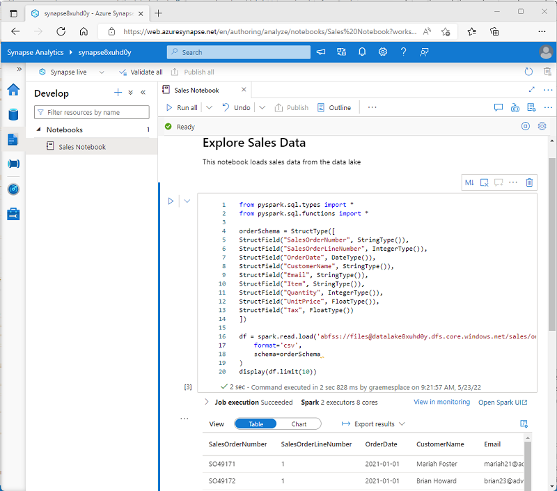

[Go back](../README.md)

# Analyze data with Apache Spark in Azure Synapse Analytics

Apache Spark is a core technology for large-scale data analytics. This lesson serves as an entry point to using Spark within context of Azure Synapse Analytics.

## Introduction

Apache Spark is an open source parallel processing framework for large-scale data processing and analytics. It is available in multiple platform implementations: 

* Azure HDInsight
* Azure Databricks
* Azure Synapse Analytics

This module explores how you can use Spark in Azure Synapse Analytics to ingest, process, and analyze data from a data lake. 

Some of the introduction nodes will be text heavy, but it is important to have a basic understanding of how Spark works.

## Get to know Apache Spark

Spark apps run as independent sets of processes on a cluster, coordinated by *SparkContext* object in the *driver*. The SparkContext connects to the cluster manager, which allocates resources across applications using an Apache Hadoop YARN implementation. Once connected, Spark acquires executors on nodes in the cluster to run your app code.

The SparkContext runs the main function and parallel operations on the cluster nodes, and then collects the results of the operations. The nodes read and write data from and to **the file system**, and cache the information in RDD's. 

## Spark pools in Azure Synapse Analytics

In Synapse, a cluster is implemented as a *Spark pool*, which provides a runtime for Spark operations.

When creating a Spark pool, you can configure: 
* The name
* Size of the VM used for the nodes in the pool
* Number of nodes in the pool, and whether the pool is of fixed size or the number of individual nodes can be *auto-scaled*
* Spark Runtime version

Spark pools in Synapse are **serverless** - they start on-demand and stop when idle.

## Use Spark in Azure Synapse Analytics
You can run different kinds of apps on Spark, including code in Python, Scala or Java. It is commonly used in two kinds of workloads: 

* Batch or stream processing jobs to ingest, clean, and transform data - often running as part of an automated pipeline.
* Interactive analytics sessions to explore, analyze, and visualize data.

### Running Spark code in notebooks

Azure Synapse Studio includes an integrated notebook interface for working with Spark. (similar interface to Jupyter/ Databricks)



Notebooks consist of one or more *cells* and contain code and markdown (usually; if the developer gives a shit - *they don't*)

### Accessing data from a Synapse Spark pool

You can use Spark in Synapse to work with data from various sources, including: 
* A data lake based on primary storage acc for Synapse workspace
* A data lake based on storage defined as a linked service
* A dedicated or serverless SQL pool in the workspace
* Azure SQL or SQL Server database
* An external Hive metastore defined as a linked service in the workspace

One of the most common uses of Spark is to **work with data in a data lake**, where you can read and write files in multiple commonly used formats, including delimited text, Parquet, Avro, and others.
* Also what I did!

## Analyze data with Spark
One of the main benefits is writing and running code in various programming languages. Default is PySpark (but you can use Scala, SQL, Java or .NET)

### Exploring data with dataframes

Natively, Spark uses a data structure called a resilient distributed dataset (RDD); but while you can write code that works directly with RDDs, the most commonly used data structure for working with structured data in Spark is the dataframe, which is provided as part of the Spark SQL library.

#### Loading data into a dataframe
Suppose you have the following CSV file **products.csv**:

```csv
ProductID,ProductName,Category,ListPrice
771,"Mountain-100 Silver, 38",Mountain Bikes,3399.9900
772,"Mountain-100 Silver, 42",Mountain Bikes,3399.9900
773,"Mountain-100 Silver, 44",Mountain Bikes,3399.9900
...
```

In a Spark notebook, to load it into a dataframe, you can run the following code:

```py
%%pyspark
df = spark.read.load('abfss://container@store.dfs.core.windows.net/products.csv',
    format='csv',
    header=True
)
display(df.limit(10))
```

The `%%pyspark` line at the beginning is called a *magic*, and tells Spark that the language used in this cell is PySpark.

#### Specifying a dataframe schema
In the previous example, the first row of the CSV file contained the column names, and Spark was able to infer the data type of each column from the data it contains. You can also specify an explicit schema for the data, which is useful when the column names aren't included in the data file, like this CSV example:

```csv
771,"Mountain-100 Silver, 38",Mountain Bikes,3399.9900
772,"Mountain-100 Silver, 42",Mountain Bikes,3399.9900
773,"Mountain-100 Silver, 44",Mountain Bikes,3399.9900
...
```

The following PySpark example shows how to specify a schema for the dataframe to be loaded from a file named product-data.csv in this format:

```py
from pyspark.sql.types import *
from pyspark.sql.functions import *

productSchema = StructType([
    StructField("ProductID", IntegerType()),
    StructField("ProductName", StringType()),
    StructField("Category", StringType()),
    StructField("ListPrice", FloatType())
    ])

df = spark.read.load('abfss://container@store.dfs.core.windows.net/product-data.csv',
    format='csv',
    schema=productSchema,
    header=False)
display(df.limit(10))
```

The section goes over filtering, selecting, grouping and other data manipulations you can do with Spark. Won't go over it here in detail now, probably they will be included in the exercise.

Some examples of the API: 

* Selecting
```py
pricelist_df = df.select("ProductID", "ListPrice")
```

* Method chaining
```py
bikes_df = df.select("ProductName", "ListPrice").where((df["Category"]=="Mountain Bikes") | (df["Category"]=="Road Bikes"))
display(bikes_df)
```

* Aggregation

```py
counts_df = df.select("ProductID", "Category").groupBy("Category").count()
display(counts_df)
```

### Using SQL expressions in Spark
The Dataframe API is part of a Spark library named Spark SQL, which enables data analysts to use SQL expressions to query and manipulate data.

#### Creating database objects in the Spark catalog
The Spark catalog is a metastore for relational data objects such as views and tables.

One of the simplest ways to make data in a dataframe available for querying in the Spark catalog is to create a temporary view:

```py
df.createOrReplaceTempView("products")
```

A **view** is temporary, meaning that it's automatically deleted at the end of the current session. You can also create tables that are persisted in the catalog to define a database that can be queried using Spark SQL.


#### Using the Spark SQL API to query data
You can use the Spark SQL API in code written in any language to query data in the catalog. For example, the following PySpark code uses a SQL query to return data from the products view as a dataframe.

```py
bikes_df = spark.sql("SELECT ProductID, ProductName, ListPrice \
                      FROM products \
                      WHERE Category IN ('Mountain Bikes', 'Road Bikes')")
display(bikes_df)
```

You also can use the `%%sql` magic to run SQL code that queries objects in the catalog, like this: 

```sql
%%sql

SELECT Category, COUNT(ProductID) AS ProductCount
FROM products
GROUP BY Category
ORDER BY Category
```

## Exercise - Analyze data with Spark
First part is very straightforward, goes over loading single or a batch of CSV files into a dataframe, and then displaying the result.

### Query data in files

```py
 %%pyspark
 df = spark.read.load('abfss://files@datalakexxxxxxx.dfs.core.windows.net/sales/orders/*.csv', format='csv'
 )
 display(df.limit(100))
```
* for the batch of CSV files (notice the wildcard)

Next is defining an explicit schema for the dataframe: 

```py
 %%pyspark
 from pyspark.sql.types import *
 from pyspark.sql.functions import *

 orderSchema = StructType([
     StructField("SalesOrderNumber", StringType()),
     StructField("SalesOrderLineNumber", IntegerType()),
     StructField("OrderDate", DateType()),
     StructField("CustomerName", StringType()),
     StructField("Email", StringType()),
     StructField("Item", StringType()),
     StructField("Quantity", IntegerType()),
     StructField("UnitPrice", FloatType()),
     StructField("Tax", FloatType())
     ])

 df = spark.read.load('abfss://files@datalakexxxxxxx.dfs.core.windows.net/sales/orders/*.csv', format='csv', schema=orderSchema)
 display(df.limit(100))
```

This will produce a dataframe with the schema defined, instead of **C1**, **C2**, **C3** etc column names.

You can also print the schema of a dataframe, for instance when checking the inferred schema, via the `printSchema()` method:

```py
 df.printSchema()
```

### Analyze data in a dataframe
You can use a vide variety of functions to manipulate, filter, group and otherwise analyze the data inside a dataframe. 

```py
 customers = df['CustomerName', 'Email']
 print(customers.count())
 print(customers.distinct().count())
 display(customers.distinct())
```

This block of code will select *CustomerName* and *Email* columns, and run *count* and a *distinct* count on it.

It is important to note that the result of an operation performed on a dataframe is a **new dataframe**.

Example of using a where method: 

```py
customers = df.select("CustomerName", "Email").where(df['Item']=='Road-250 Red, 52')
print(customers.count())
print(customers.distinct().count())
display(customers.distinct())
```

Here the *where* method is chain-called after the select, and in this case the resulting dataframe of *select* method is used as the source dataframe for the *where* method.

#### Aggregate and group data in a dataframe
Example: 

```py
productSales = df.select("Item", "Quantity").groupBy("Item").sum()
display(productSales)
```

The **groupBy** method groups the rows by *Item*, and the subsequent **sum** aggregate function is applied to all of the remaining numeric columns (in this case, *Quantity*)

Another example: 

```py
yearlySales = df.select(year("OrderDate").alias("Year")).groupBy("Year").count().orderBy("Year")
display(yearlySales)
```

The code shows the number of sales orders per year. Note that the select method includes a SQL **year** function to extract the year component of the *OrderDate* field, and then an **alias** method is used to assign a column name to the extracted year value. The data is then grouped by the derived *Year* column and the count of rows in each group is calculated before finally the **orderBy** method is used to sort the resulting dataframe.

### Query data using Spark SQL
Following section describes working with Spark SQL API. It starts by loading the CSV's into a **temporary view**: 

```py
df.createOrReplaceTempView("salesorders")

spark_df = spark.sql("SELECT * FROM salesorders")
 display(spark_df)
```

It then runs a `SELECT *` as SQL code embedded in PySpark.

#### Run SQL code in a cell
You can run raw SQL code against the created temp view. Create a new cell and prefix it with `%%sql` magic, and run the following code: 

```sql
 %%sql
 SELECT YEAR(OrderDate) AS OrderYear,
        SUM((UnitPrice * Quantity) + Tax) AS GrossRevenue
 FROM salesorders
 GROUP BY YEAR(OrderDate)
 ORDER BY OrderYear;
```

### Visualize data with Spark
Going to go over a bit more detail with this one, since I have no direct experience with data visualization (especially MatPlotLib)

#### View results as a chart
Example of using the in-built visualization options: 


#### Get started with matplotlib
Start by running the following SQL query:

```py
 sqlQuery = "SELECT CAST(YEAR(OrderDate) AS CHAR(4)) AS OrderYear, \
                 SUM((UnitPrice * Quantity) + Tax) AS GrossRevenue \
             FROM salesorders \
             GROUP BY CAST(YEAR(OrderDate) AS CHAR(4)) \
             ORDER BY OrderYear"
 df_spark = spark.sql(sqlQuery)
 df_spark.show()
```

To visualize this, we are going to use **matplotlib**. This library is the core plotting library on which many others are based, and provides a great deal of flexibility in creating charts.

Add the following code: 

```py
from matplotlib import pyplot as plt

# matplotlib requires a pandas dataframe, not a spark one
df_sales = df_spark.toPandas()

# create a bar plot of revenue by year
plt.bar(x=df_sales['OrderYear'], height=df_sales['GrossRevenue'])

# display the plot
plt.show()
```

Essentially, you need to use **Pandas** dataframe. To create a bar chart, simply provide the X and Y vales, and show the result.

There are many ways to customize the resulting plot, from changing colors, naming the axis etc.

Run the following code: 

```py
 # Clear the plot area
 plt.clf()

 # Create a bar plot of revenue by year
 plt.bar(x=df_sales['OrderYear'], height=df_sales['GrossRevenue'], color='orange')

 # Customize the chart
 plt.title('Revenue by Year')
 plt.xlabel('Year')
 plt.ylabel('Revenue')
 plt.grid(color='#95a5a6', linestyle='--', linewidth=2, axis='y', alpha=0.7)
 plt.xticks(rotation=45)

 # Show the figure
 plt.show()
```

This will produce the following plot: 


(I left the original for comparison purpose)

A plot is technically contained with a **Figure**. In the previous examples it was created implicitly, but it can be created explicitly: 

```py
 # Clear the plot area
 plt.clf()

 # Create a Figure
 fig = plt.figure(figsize=(8,3)) # NOTICE HERE!

 # Create a bar plot of revenue by year
 plt.bar(x=df_sales['OrderYear'], height=df_sales['GrossRevenue'], color='orange')

 # Customize the chart
 plt.title('Revenue by Year')
 plt.xlabel('Year')
 plt.ylabel('Revenue')
 plt.grid(color='#95a5a6', linestyle='--', linewidth=2, axis='y', alpha=0.7)
 plt.xticks(rotation=45)

 # Show the figure
 plt.show()
```

The result is the same. 

##### Multiple subplots, each on its own axis


#### Use the seaborn library
Matplotlib often requires complex code to achieve the best results. Instead of it, you can use another library which abstracts over it, such as **seaborn**

Example:

```py
 import seaborn as sns

 # Clear the plot area
 plt.clf()

 # Create a bar chart
 ax = sns.barplot(x="OrderYear", y="GrossRevenue", data=df_sales)
 plt.show()
```

## Knowledge check
1. <u>Which definition best describes Apache Spark?</u>

* A highly scalable relational database management system.
* A virtual server with a Python runtime.
* A distributed platform for parallel data processing using multiple languages.


<details>
<summary>Answer</summary>
The correct answer is: <b>A distributed platform for parallel data processing using multiple languages.</b>
</details><br>

2. <u>You need to use Spark to analyze data in a parquet file. What should you do?</u>

* Load the parquet file into a dataframe.
* Import the data into a table in a serverless SQL pool.
* Convert the data to CSV format.

<details>
<summary>Answer</summary>
The correct answer is: <b>Load the parquet file into a dataframe.</b>
</details><br>

3. <u>You want to write code in a notebook cell that uses a SQL query to retrieve data from a view in the Spark catalog. Which magic should you use?  </u>

* %%spark
* %%pyspark
* %%sql

<details>
<summary>Answer</summary>
The correct answer is: <b>%%sql</b>
</details><br>