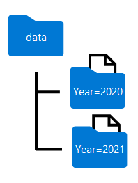
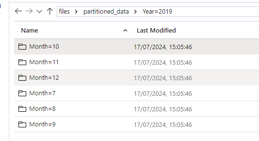

[Go back](../README.md)

# Transform data with Spark in Azure Synapse Analytics

More of the same as the last lesson. Goes over dataframes, loading the data from data lake and some transformations. 

## Modify and save dataframes
We've already seen what a dataframe is, how you can use it to load some data (for example, CSV), transform it (*select*, *filter*, *aggregate*), now we are going to save the resulting dataframe into a new format in the data lake.

#### Loading: 
```py
order_details = spark.read.csv('/orders/*.csv', header=True, inferSchema=True)
display(order_details.limit(5))
```

#### Transforming:
```py
from pyspark.sql.functions import split, col

# Create the new FirstName and LastName fields
transformed_df = order_details.withColumn("FirstName", split(col("CustomerName"), " ").getItem(0)).withColumn("LastName", split(col("CustomerName"), " ").getItem(1))

# Remove the CustomerName field
transformed_df = transformed_df.drop("CustomerName")

display(transformed_df.limit(5))
```

#### Saving:
```py
transformed_df.write.mode("overwrite").parquet('/transformed_data/orders.parquet')
print ("Transformed data saved!")
```

Notice the dataframe is saved into a different file format - Parquet.

## Partition data files
Partitioning is an optimization technique that enables spark to maximize performance across the worker nodes. Essentially the performance gain is achieved by eliminating the unnecessary disk IO (which is generally the slowest part of computing)

### Partition the output file
To save a dataframe as a partitioned set of files, use the **partitionBy** method when writing the data.

```py
from pyspark.sql.functions import year, col

# Load source data
df = spark.read.csv('/orders/*.csv', header=True, inferSchema=True)

# Add Year column
dated_df = df.withColumn("Year", year(col("OrderDate")))

# Partition by year
dated_df.write.partitionBy("Year").mode("overwrite").parquet("/data")
```

The folder names generated when partitioning a dataframe include the partitioning column name and value in a **column=value** format, as shown here:




You can partition the data by multiple columns, which results in a hierarchy of folders for each partitioning key. For example, you could partition the order in the example by year and month, so that the folder hierarchy includes a folder for each year value, which in turn contains a subfolder for each month value.

### Filter parquet files in a query
When reading data from parquet files into a dataframe, you have the ability to pull data from any folder within the hierarchical folders. 

In the following example, the following code will pull the sales orders, which were placed in 2020.

```py
orders_2020 = spark.read.parquet('/partitioned_data/Year=2020')
display(orders_2020.limit(5))
```

Code in example would pull all the sales order which were placed in 2020. 

## Transform data with SQL
The SparkSQL library, which provides the dataframe structure also enables you to use SQL as a way of working with data. With this approach, You can query and transform data in dataframes by using SQL queries, and persist the results as tables.

### Define tables and views
Table definitions in Spark are stored in the *metastore*, a metadata layer that encapsulates relational abstraction over files. 
*External* tables are relational tables in the metastore that reference files in a data lake location that you specify. 

Note that external tables are "loosely bound" to the underlying files; they are **INDEPENDENT** from the data in the files! Meaning, if you alter the data in the external table, the underlying data remains unchanged!

You can also define *managed* tables, for which the underlying data files are stored in an internally managed storage location associated with the metastore. Managed tables are "tightly-bound" to the files, and dropping a managed table deletes the associated files.

Following code example saves a dataframe as an external table, in the **/sales_orders_table** folder in the data lake: 

```sql
order_details.write.saveAsTable('sales_orders', format='parquet', mode='overwrite', path='/sales_orders_table')
```

### Use SQL to query and transform the data
After defining table, you can use SQL to work with it.

```py
# Create derived columns
sql_transform = spark.sql("SELECT *, YEAR(OrderDate) AS Year, MONTH(OrderDate) AS Month FROM sales_orders")

# Save the results
sql_transform.write.partitionBy("Year","Month").saveAsTable('transformed_orders', format='parquet', mode='overwrite', path='/transformed_orders_table')
```

### Query the metastore
Because the table was created in the metastore when creating it as external table, SQL can be used to directly query it: 

```sql
%%sql

SELECT * FROM transformed_orders
WHERE Year = 2021
    AND Month = 1
```

### Drop tables
You can use the `DROP` command to delete the table definitions from metastore without affecting the files in data lake.

```sql
%%sql

DROP TABLE transformed_orders;
DROP TABLE sales_orders;
```

# Exercise
Exercise goes over several data transformations in Spark.

Starts off with reading a batch of CSV files: 

```py
order_details = spark.read.csv('/data/*.csv', header=True, inferSchema=True)
display(order_details.limit(5))
```

Next, it splits the column *CustomerName* into *LastName*, and *FirstName* columns:

```py
from pyspark.sql.functions import split, col

# Create the new FirstName and LastName fields
transformed_df = order_details.withColumn("FirstName", split(col("CustomerName"), " ").getItem(0)).withColumn("LastName", split(col("CustomerName"), " ").getItem(1))

# Remove the CustomerName field
transformed_df = transformed_df.drop("CustomerName")

display(transformed_df.limit(5))
```

Which it then saves as a Parquet file:

```py
transformed_df.write.mode("overwrite").parquet('/transformed_data/orders.parquet')
```

#### Data partition
Following query will create new *Year* and *Month* columns from the *OrderDate*, and partition the data by those two columns:

```py
from pyspark.sql.functions import year, month, col

dated_df = transformed_df.withColumn("Year", year(col("OrderDate"))).withColumn("Month", month(col("OrderDate")))
display(dated_df.limit(5))
dated_df.write.partitionBy("Year","Month").mode("overwrite").parquet("/partitioned_data")
print ("Transformed data saved!")
```

The resulting Parquet folder will look like this: 

 

To read the saved data, you have to provide the **path** to the partition you want, for instance for **all of 2020**, you would run a query like: 

```py
orders_2020 = spark.read.parquet('/partitioned_data/Year=2020/Month=*')
display(orders_2020.limit(5))
```

### Use SQL to transform data
To start, need to load data into metastore as external table: 

```py
order_details.write.saveAsTable('sales_orders', format='parquet', mode='overwrite', path='/sales_orders_table')
```

With the table created, you can use SQL to work with the data. You can use the `spark.sql` API: 

```py
sql_transform = spark.sql("SELECT *, YEAR(OrderDate) AS Year, MONTH(OrderDate) AS Month FROM sales_orders")
display(sql_transform.limit(5))
sql_transform.write.partitionBy("Year","Month").saveAsTable('transformed_orders', format='parquet', mode='overwrite', path='/transformed_orders_table')
     
```

Or, you can use SQL directly, since the tables are saved in the metastore: 

```sql
%%sql

SELECT * FROM transformed_orders
WHERE Year = 2021
    AND Month = 1
```

Finally, in the exercise it drops the tables: 

```sql

%%sql

DROP TABLE transformed_orders;
DROP TABLE sales_orders;
```

Note that the created files still exist after running the command!

## Knowledge check
1. Which method of the Dataframe object is used to save a dataframe as a file? 


* toFile()
* write()
* save()

<details>
<summary>Answer</summary>
The correct answer is: <b>write()</b>
</details><br>

2. Which method is used to split the data across folders when saving a dataframe? 

* splitBy()
* distributeBy()
* partitionBy()

<details>
<summary>Answer</summary>
The correct answer is: <b>partitionBy()</b>
</details><br>

3. What happens if you drop an external table that is based on existing files? 

* An error – you must delete the files first
* The table is dropped from the metastore but the files remain unaffected
* The table is dropped from the metastore and the files are deleted

<details>
<summary>Answer</summary>
The correct answer is: <b>The table is dropped from the metastore but the files remain unaffected.</b>
</details><br>